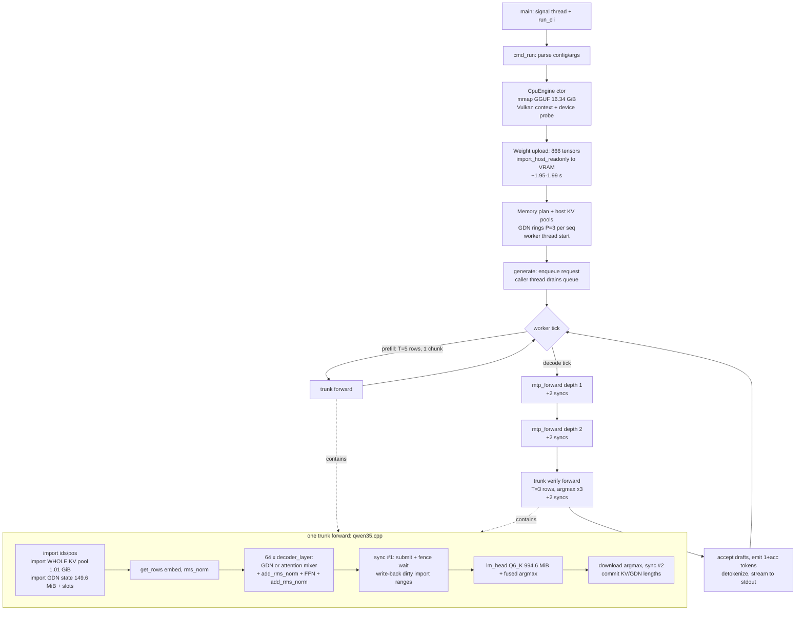

# HALO inference engine — process documentation (evidence-only)

- **Date:** 2026-09-27
- **Generator:** Kimi Code CLI (agent run on the target machine), documenting the repository at `/home/alexander-vegazo/Documents/repos/halo`
- **Audience:** AI models with no access to the machine. Every fact below comes from a command run or a file read during this session. Code facts cite `path:line`. Measurements include the command and trimmed output. Undeterminable items are marked `UNKNOWN` (with the reason); inferences are marked `INFERRED` (with reasoning).
- **Scope rule:** observations only. This document contains **no fix recommendations**.
- Temporary measurement artifacts live in `/home/alexander-vegazo/Documents/repos/halo/process_tools/` (benchmark logs, op-timing dumps, mpstat capture, bench artifacts). No halo source file or build configuration was modified; nothing was committed.

## 1. Executive summary (observations only)

Measured on the same machine, same model (`Qwen3.8-27B-UD-Q4_K_XL.gguf`, 16.34 GiB), same prompt (`"The capital of France is"`), greedy decoding:

| Engine | Decode tok/s (mean of runs) | Notes |
|---|---|---|
| halo, Vulkan backend, default (`--mtp-draft 2`) | **4.04** (4.03 / 4.03 / 3.90 / 4.20) | `--ctx 4096 --parallel 1` pinned; default ctx 32768 fails (§12.6) |
| halo, Vulkan backend, `--mtp-draft 0` | **2.24** (2.25 / 2.23 / 2.24) | plain decoding, no speculation |
| llama.cpp HIP build | **12.0** (12.0 / 12.0 / 12.0) | full 262144-token context allocated |
| llama.cpp Vulkan build (RADV, same driver stack halo uses) | **12.3** (12.3 / 12.3 / 12.3) | RADV/Vulkan itself is therefore not halo's bottleneck |
| llama.cpp HIP + MTP speculative decoding | 22.0 | measured in an earlier session (server, `--spec-type draft-mtp --spec-draft-n-max 2`, 400-token run, ~66% draft acceptance); not re-measured this session |

Observed facts that bear on the gap (all detailed in later sections):

1. **halo re-imports all state every forward call.** KV pool image (whole pool, 1.01 GiB at the benchmark's `--ctx 4096 --parallel 1`), GDN recurrent + conv state (149.62 MiB per sequence) plus rollback slots (~449 MiB of write-only imports) are copied into fresh per-call Vulkan buffers on every forward, and the device-written ranges are mirrored back to host memory at every `Stream::wait()` (`src/models/qwen35.cpp:535-544`, `src/backend/vulkan_adapter.cpp:330-346,805-810,900-924`). Runtime log: `backend 'vulkan' selected; KV/GDN state stays host-resident until WS-BI-2` (§14.1). At the default `--ctx 32768 --parallel 4` the single KV-pool import buffer would be 34,393,292,800 B and the run fails: `Buffer::create: 34393292800 bytes exceeds maxMemoryAllocationSize 4294967292` (§12.6).
2. **Matvec kernels are ~96% of GPU time and run at 25–62 GB/s effective.** Per-dispatch GPU timings (§13): matvec kernels (q5_k 43.4%, iq4_xs 21.2%, q4_k 14.3%, q6_k 14.1%, others ~3%) dominate; the 994.63 MiB Q6_K LM head takes ~16.8 ms/call (≈62 GB/s); the 58.4 MiB Q5_K FFN matvec takes ~2.27 ms (≈27 GB/s). llama.cpp's 12 tok/s implies ~206 GB/s effective over 17.2 GB of weights (INFERRED, §12.5).
3. **~590 dispatches per emitted token, no graphs.** 9,396 dispatches for 16 emitted tokens (8 decode ticks + 1 prefill + 14 MTP forwards); each op is an individual `vkCmdDispatch` with descriptor-set allocation (`backends/vulkan/src/stream.cpp:148-212`); every forward does 2 blocking submit+wait cycles, ~6 per decode tick; there is no command-buffer replay/graph mechanism (`docs/adr/ADR-001-backend-interface.md:485` lists "HIP graphs and Vulkan command buffers" as "possible, deliberately not built now"). llama.cpp's HIP build has `GGML_HIP_GRAPHS=ON` (§5.4).
4. **GPU 81–87% busy during halo decode; CPU almost idle.** `gpu_busy_percent` sampled 81–87% during decode; mpstat showed all-core average 2.12% usr with the hottest core at 14.4% (§12.5). Decode is single-engine-worker-thread (`src/runtime/engine.cpp:414`) and fence-bound.
5. **MTP speculative decoding gives halo 1.80× (2.24 → 4.04 tok/s)** at ~2.0 emitted tokens per tick on this prompt (measured dispatch counts, §13), versus plain 2.24 tok/s. Even with it, halo is 3.0× slower than llama.cpp plain and 5.4× slower than llama.cpp+spec (earlier-session 22 tok/s).
6. **Vulkan prefill of ≥24 prompt tokens reliably crashes the GPU** (`vkQueueSubmit failed: VK_ERROR_DEVICE_LOST`) on the current working tree; ≤23 tokens works (§12.7). Prompts ≤5 tokens were used for all decode benchmarks. `halo bench model` sub-benchmarks that run longer prompts fail the same way (§13.3).
7. halo's own design target (PRD) is "~60+ tok/s equivalent" and "≥2× over the best local baseline" (`docs/HALO_PRD_v1.1.md:337`); the Vulkan backend path is explicitly unfinished: "a GPU engine is therefore correct but slow" (`src/runtime/engine.cpp:6-8`).

## 2. Machine specification

Machine: GMKtec EVO-X2 (hostname `alexander-vegazo-NucBox-EVO-X2`).

### 2.1 CPU (`lscpu`, trimmed)

```
Architecture:            x86_64
CPU(s):                  32
On-line CPU(s) list:     0-31
Vendor ID:               AuthenticAMD
Model name:              AMD RYZEN AI MAX+ 395 w/ Radeon 8060S
CPU family:              26
Model:                   112
Thread(s) per core:      2
Core(s) per socket:      16
Socket(s):               1
Frequency boost:         enabled
CPU(s) scaling MHz:      41%
CPU max MHz:             5187.5000
CPU min MHz:             625.0000
L1d cache:               768 KiB (16 instances)
L1i cache:               512 KiB (16 instances)
L2 cache:                16 MiB (16 instances)
L3 cache:                64 MiB (2 instances)
NUMA node(s):            1
NUMA node0 CPU(s):       0-31
```

`/proc/cpuinfo` flags (first processor, trimmed to notable): `sse sse2 sse4_1 sse4_2 avx avx2 f16c fma avx512f avx512dq avx512cd avx512bw avx512vl avx512ifma avx512vbmi avx512_vbmi2 avx512_vnni avx512_bf16 avx512_bitalg avx512_vpopcntdq avx512_vp2intersect avx_vnni sha_ni vaes vpclmulqdq gfni bmi1 bmi2 rdrand rdseed adx smap clflushopt clwb xsave xsaveopt xsavec xsaves movdiri movdir64b amd_lbr_v2 topoext hw_pstate`.

Governor/driver (`cat /sys/devices/system/cpu/cpu0/cpufreq/scaling_governor|scaling_driver|scaling_cur_freq`):

```
powersave
amd-pstate-epp
1928765          <- Hz at sample time (idle-ish); clocks float, cannot be pinned without sudo
```

`numactl --hardware`: 1 node, node 0 cpus 0-31, node 0 size 31211 MB.

### 2.2 RAM / swap (`free -h`, `swapon --show`, `/proc/sys/vm/swappiness`)

```
               total        used        free      shared  buff/cache   available
Mem:            30Gi       6.6Gi       3.7Gi        60Mi        20Gi        23Gi
Swap:          8.0Gi       3.2Gi       4.8Gi
/swap.img file   8G 3.2G   -1
swappiness = 60
```

Note: 128 GiB physical LPDDR5 is split by firmware: 96 GiB GPU carveout + a crashkernel reservation (`crashkernel=...128G-:4096M` in `/proc/cmdline`, i.e. 4096M on this 128 GiB machine) leaves ~30 GiB visible to Linux (INFERRED split — the three numbers account for the 128 GiB total). The GPU carveout is therefore ~3.2× the host-visible RAM.

### 2.3 Model filesystem (`df -h`, `lsblk`)

```
Filesystem      Size  Used Avail Use% Mounted on
/dev/nvme0n1p2  1.8T  146G  1.6T   9% /
```

The model file and both repos are on the same NVMe root filesystem. `lsblk` shows only snap loop devices plus the NVMe root (trimmed).

### 2.4 GPU

`rocminfo` (trimmed):

```
Name:                    gfx1151
Marketing Name:          AMD Radeon 8060S Graphics
Max Clock Freq. (MHz):   2900
Compute Unit:            40
Memory Properties:       APU
Wavefront Size:          32(0x20)
Workgroup Max Size:      1024(0x400)
Pool 1/2 Size:           100663296 KB (96 GiB, x2)
Pool 3 Size:             64 KB
CPU agent:               AMD RYZEN AI MAX+ 395, Max Clock 5187 MHz, 32 CUs (threads)
NPU agent:               aie2p "RyzenAI-npu5" (present, unused by either engine here)
```

`rocm-smi --showproductname --showmeminfo vram --showclocks` (idle, trimmed):

```
GPU[0] : mclk clock level: 2: (1000Mhz)
GPU[0] : sclk clock level: 1: (690Mhz)
GPU[0] : VRAM Total Memory (B): 103079215104        <- 96.0 GiB carveout
GPU[0] : VRAM Total Used Memory (B): 896741376
GPU[0] : Card Series: AMD Radeon 8060S Graphics
GPU[0] : GFX Version: gfx1151
```

`vulkaninfo --summary` (trimmed):

```
Vulkan Instance Version: 1.4.341
GPU0:
    apiVersion         = 1.4.335
    driverVersion      = 26.0.8
    vendorID/deviceID  = 0x1002 / 0x1586
    deviceType         = PHYSICAL_DEVICE_TYPE_INTEGRATED_GPU
    deviceName         = Radeon 8060S Graphics (RADV STRIX_HALO)
    driverID           = DRIVER_ID_MESA_RADV
    driverInfo         = Mesa 26.0.8-1ubuntu0.3
GPU1: llvmpipe (LLVM 21.1.8, 256 bits)   <- software device, unused
```

DPM clocks (`cat /sys/class/drm/card0/device/pp_dpm_sclk pp_dpm_mclk`, idle):

```
sclk: 0: 600Mhz   1: 752Mhz *   2: 2900Mhz
mclk: 0: 400Mhz   1: 800Mhz     2: 1000Mhz *
```

During halo decode the reported sclk level floated around 2.1 GHz (`1: 2112Mhz *` … `1: 2129Mhz *` — the level table is dynamic), never the 2900 MHz ceiling; clocks cannot be pinned without sudo. `mem_info_vram_total` = 103079215104, `mem_info_gtt_total` = 16363974656 (GTT 15.24 GiB).

Thermals (`sensors`, idle): CPU `Tctl +45.1°C` (k10temp), GPU edge `+40.0°C`, `PPT 12.07 W`, NVMe composite `+38.9°C`. No thermal throttling was observed; halo's own bench hardware probe recorded `power_w 13.049, temperature_c 46.0, gpu_performance_level "auto"`.

### 2.5 IOMMU

`/sys/class/iommu/` contains `ivhd0` — IOMMU is present/on. `/proc/cmdline` has no `iommu=` override (AMD default on): `BOOT_IMAGE=/boot/vmlinuz-7.0.0-31-generic root=UUID=... ro quiet splash crashkernel=2G-4G:320M,4G-32G:512M,32G-64G:1024M,64G-128G:2048M,128G-:4096M`.

## 3. OS and environment

`uname -a`:

```
Linux alexander-vegazo-NucBox-EVO-X2 7.0.0-31-generic #31-Ubuntu SMP PREEMPT_DYNAMIC Sat Aug  1 04:26:38 UTC 2026 x86_64 GNU/Linux
```

`/etc/os-release` (head): `PRETTY_NAME="Ubuntu 26.04.1 LTS"`, `VERSION_CODENAME=resolute`.

`ulimit -a` (notable): `max locked memory 8192 kB`, `open files 524288`, `max user processes 124648`, core file size 0.

Transparent hugepages (`cat /sys/kernel/mm/transparent_hugepage/enabled`): `always [madvise] never`.

Environment variables relevant to the engines: none set in the shell (`env | grep -E '^(HALO|RADV|HSA|VK|AMD|ROCM|MESA)_'` → empty). halo reads these env vars (found by grepping the repo for `"HALO_..."` string literals): all the CLI `HALO_*` settings of §7 (`tools/halo/config.cpp:64-119`), plus `HALO_LOG_FILE`, `HALO_LOG_FORMAT`, `HALO_LOG_LEVEL` (`src/core/log.cpp:41`), `HALO_VK_DEVICE`, `HALO_VK_VALIDATION` (`backends/vulkan/src/context.cpp:76,184,507`), `HALO_VK_OP_TIMINGS` (`backends/vulkan/src/stream.cpp:23`, the per-dispatch GPU timer used in §13), `HALO_VERSION` (`src/autotune/profile_key.cpp`). The build additionally needs `LD_LIBRARY_PATH=/home/alexander-vegazo/halo-toolchain/usr/lib/x86_64-linux-gnu` (for glslc's `libshaderc.so.1`), not the run.

Heavy processes snapshot (`ps aux --sort=-%cpu | head`, trimmed): cadvisor 7.5% CPU, two `kimi` agent processes ~3%/1.8%, ptyxis 1.3%, gnome-shell 0.9%, prometheus 0.9%, dockerd 0.8%. No other GPU workloads were running during benchmarks (GPU verified idle between runs via `rocm-smi` VRAM used ≈ 0.86 GiB and `gpu_busy_percent` ≈ 1).

## 4. Toolchain

| Tool | Version | Source of fact |
|---|---|---|
| gcc / g++ | 15.2.0 (Ubuntu 15.2.0-16ubuntu1) | `g++ --version` |
| clang (ROCm) | `/opt/rocm/llvm/bin/clang++` (LLVM 23.0git per linked libs) | halo CMakeCache `CMAKE_CXX_COMPILER`; `ldd` shows `libclang-cpp.so.23.0git` |
| cmake | 4.2.3 | `cmake --version` |
| ninja | 1.13.2 | `ninja --version` |
| glslc (halo toolchain) | `shaderc 2026.1-1, glslang 16.1.0-1`, at `/home/alexander-vegazo/halo-toolchain/usr/bin/glslc` (needs its own dir on `LD_LIBRARY_PATH`) | `glslc --version` |
| glslc (llama.cpp Vulkan build) | `shaderc 2026.1-1, glslang 16.1.0-1`, at `/tmp/glslc-new/usr/bin/glslc` (same upstream version, separate install) | `/tmp/glslc-new/usr/bin/glslc --version` with its lib dir on `LD_LIBRARY_PATH` |
| hipcc / amdclang++ | present at `/usr/bin/hipcc`, `/usr/bin/amdclang++` | `which` |
| perf | **installed** (`/usr/bin/perf`), but `kernel.perf_event_paranoid = 4` so CPU event access is denied without sudo | `which perf`; `perf stat -e cycles true` → error text quoting the paranoid levels |
| mpstat, numactl, sensors | installed | `which` |

ROCm packages (`dpkg -l | grep -iE 'rocm|hip'`, trimmed): the `amdrocm-*10.0 10.0.0-4` family is installed, including `amdrocm-core10.0-gfx1151`, `amdrocm-core-sdk10.0-gfx1151`, `amdrocm-core-dev10.0-gfx1151` and per-arch blas packs. `ldconfig -p` shows `libamdhip64.so.7` and `libhsa-runtime64.so.1` under `/usr/lib/x86_64-linux-gnu`; halo links the ROCm libs from `/opt/rocm/lib` (§6.4). The user's session notes call this "ROCm/HIP 7.15"; the dpkg package family version is 10.0.0-4 (distro packaging); the HIP runtime SONAME is `libamdhip64.so.7`. Exact marketing-version mapping: UNKNOWN (no `rocm` metapackage version string found that says 7.15; recorded as-is).

## 5. Repository structure

### 5.1 Git state

```
$ git remote -v
origin  https://github.com/AlexanderVegazo26/halo.git (fetch/push)
$ git branch --show-current
main
$ git rev-parse HEAD
730ba76b41d3008eb62ab234e753b95eef1dcf65
$ git log --oneline -3
730ba76 docs: evox2context -- M10 fixed; first 27B runs on CPU and RADV are token-identical
0d69e13 tests: skip the profile-DB chain tests when the GPU power state is unpinned
8d04472 runtime: reconcile the checkpoint budget across tiers (M10)
```

`git status --short` (uncommitted work in the tree — Vulkan performance work; the benchmarked binary is built from this working tree):

```
 M backends/vulkan/shaders/common/dequant_iq3_s.glsl
 M backends/vulkan/shaders/common/dequant_iq4_nl.glsl
 M backends/vulkan/shaders/common/dequant_iq4_xs.glsl
 M backends/vulkan/shaders/common/dequant_q3_k.glsl
 M backends/vulkan/shaders/common/dequant_q4_k.glsl
 M backends/vulkan/shaders/common/dequant_q5_k.glsl
 M backends/vulkan/shaders/common/dequant_q6_k.glsl
 M backends/vulkan/shaders/common/dequant_q8_0.glsl
 M backends/vulkan/shaders/common/get_rows_main.glsl
 M backends/vulkan/shaders/common/halo_common.glsl
 M backends/vulkan/shaders/common/matvec_quant_main.glsl
 M backends/vulkan/src/buffer.cpp
 M backends/vulkan/src/context.cpp
 M backends/vulkan/src/ops.cpp
 M backends/vulkan/src/stream.cpp
 M include/halo/backend/backend.h
 M include/halo/backends/vulkan/buffer.h
 M include/halo/backends/vulkan/context.h
 M include/halo/backends/vulkan/kernel.h
 M include/halo/backends/vulkan/ops.h
 M src/backend/vulkan_adapter.cpp
 M src/models/qwen35.cpp
?? build-dev/
?? build-m2/
```

`git diff --stat`: 22 files, 420 insertions(+), 47 deletions(-). One-line purpose of each changed area (from reading the diffs):

| File(s) | Purpose of the uncommitted change (from diff contents) |
|---|---|
| `shaders/common/matvec_quant_main.glsl` (+75) | New decode-only pipeline variant via specialization constant `BATCHED` (line 31): skipping the batched accumulator body "cost decode ~45%" in register pressure; new group-of-8 column mapping for `HALO_DQ_QK >= 8` so 8 dequant calls share block-header loads and byte reads merge into dword loads; comment notes a subgroup-shuffle reduction "was tried and was 2x slower (RDNA wave64 shuffles are LDS swizzles)" |
| `shaders/common/dequant_*.glsl` | Define `HALO_DQ_QK` per type for the group-of-8 mapping; `dequant_iq3_s.glsl` stages the 512-entry IQ3S grid in workgroup-shared memory (a dynamically indexed const array "is lowered to scratch (local) memory... ~100x slower"); `dequant_q4_k.glsl` makes `scale_min_k4` branchless (divergent `j<4` branch executed both sides under exec-masking) |
| `shaders/common/halo_common.glsl` | Branchless `read_f16` byte reader (alignment branch was executed both sides under exec-masking) |
| `shaders/common/get_rows_main.glsl` (+6) | `HALO_DQ_QK`-related define (same scheme) |
| `src/backend/vulkan_adapter.cpp` (+103) | Writable imports (`import_host`) now create **host-cached mapped** buffers instead of device-local staged copies ("as a device-local buffer each direction is a staged GPU transfer with a fence round-trip per 16 MiB chunk, which dominated decode time (~500 blocking round-trips per token)"); new `import_host_writeonly` with clamped write-back; per-range dirty tracking (`dirty_add`/`dirty_take`) so only device-written byte ranges of writable imports are mirrored back at `Stream::wait()`; precise dirty ranges for `kv_write` via the host block table |
| `backends/vulkan/src/buffer.cpp`, `context.cpp`, `buffer.h`, `context.h` | VkBuffer/VkMemory recycling cache (4 GiB cap; "2 GiB was measured to still evict ~15 entries per step... 4 GiB gives zero post-warmup misses") so the per-step identically-sized allocations skip `vkAllocateMemory/vkBindBufferMemory/vkMapMemory` |
| `backends/vulkan/src/stream.cpp` (+21) | `HALO_VK_OP_TIMINGS` env var: per-dispatch GPU timestamp collection, dumped as `<kernel> <ns>` lines at each `wait()` |
| `backends/vulkan/src/ops.cpp`, `ops.h`, `kernel.h` | Pass the `BATCHED` specialization constant (decode: 0) and optional `gemv_workgroup` override |
| `include/halo/backend/backend.h` | `import_host_writeonly` interface addition |
| `src/models/qwen35.cpp` (+14) | Use `import_wo` (write-only imports) for conv/recurrent rollback slots with the write-back clamp `min(T, n_slots) * slot_bytes` |

At git HEAD (committed), `import_host` used `device_copy` (device-local) — `git show HEAD:src/backend/vulkan_adapter.cpp` line 298/302 — i.e., the committed code was slower still; the working tree is the faster configuration.

### 5.2 Directory layout (2-3 levels, trimmed)

```
halo/
├── CMakeLists.txt  README.md  memory.md  ADVERSARIAL_REVIEW.md
├── include/halo/            # public headers (backend, runtime, models, ...)
├── src/
│   ├── api/  autotune/  backend/  core/  hardware/  kv_cache/  memory/
│   ├── model/  models/  profiling/  runtime/  sampling/  speculative/
│   ├── state/  template/  tensor/  tokenizer/
├── backends/
│   ├── cpu/                 # reference CPU kernels + thread pool
│   ├── vulkan/              # production GPU path: src/, include/, shaders/
│   │   └── shaders/         # attention common eltwise get_rows linear_attn
│   │                        # matmul norm reduce rope sample (GLSL compute)
│   └── hip/                 # HIP backend (device mode not runnable, §16)
├── tools/halo/              # the `halo` CLI binary (run/serve/bench/tune/...)
├── tests/ (fixtures/ unit/) # driven via ctest
├── bench/workloads/  cmake/patches/  docs/ (adr/ dev/ reviews/)
├── python/tools/  scripts/evox2/  native/  # native AOT experiment dirs
├── build-dev/               # Ninja dev build (the benchmarked binary)
└── build-m2/                # second, untracked build tree (not used here)
```

### 5.3 Lines of code (`wc -l` fallback; `cloc` not installed)

| Component | Files counted | Lines |
|---|---|---|
| `src/` (*.cpp *.h) | all | 24,320 |
| `backends/` total | *.cpp *.h *.hpp *.glsl *.comp | 9,929 |
| ↳ `backends/vulkan` (src + include + shaders) | all shader+host sources | 5,079 |
| ↳ ↳ of which `shaders/` | 13 *.glsl = 627, 33 *.comp = 1,426 | 2,053 |
| ↳ `backends/hip` + `backends/cpu` | *.cpp *.h | 4,850 |
| `include/` | *.h | 9,087 |
| `tools/` | *.cpp *.h | 2,603 |
| `tests/` | *.cpp *.h | 35,023 |

### 5.4 Relationship to llama.cpp and splash

- **llama.cpp is NOT linked or vendored** — no ggml/llama.cpp code in the repo (the engine is original C++23; `ldd` in §6.4 shows no ggml libs). It is a measurement/reference baseline only. Two builds exist on the machine:
  - HIP: `/home/alexander-vegazo/llama.cpp/build/bin/llama-cli`, `version: 0.5.0-dev (build 11151, commit bd4f514db)`, repo commit `bd4f514db`, working tree clean. CMakeCache: `CMAKE_BUILD_TYPE=Release`, `GGML_HIP=ON`, `GGML_HIP_MMQ_MFMA=ON`, `GGML_HIP_GRAPHS=ON`, `GGML_HIP_NO_VMM=ON`, `GGML_NATIVE=ON`, `CMAKE_HIP_ARCHITECTURES=gfx1151`, `GGML_CUDA=OFF`, `GGML_BACKEND_DL=OFF`.
  - Vulkan: `/home/alexander-vegazo/llama.cpp/build-vulkan/bin/llama-cli`, same llama.cpp commit/build number. CMakeCache: `GGML_VULKAN=ON`, `GGML_HIP=OFF`, `CMAKE_BUILD_TYPE=Release`, `CMAKE_CXX_FLAGS=-I/tmp/spirv-h/usr/include`, `Vulkan_GLSLC_EXECUTABLE=/tmp/glslc-new/usr/bin/glslc` (shaderc 2026.1-1).
- **splash** (github.com/incoai/splash, Apple/Metal engine for the same model) is a design reference only, not linked: "HALO generalizes that lesson: the engine is engineered for Qwen3.8-27B first" (`docs/HALO_PRD_v1.1.md:41`); splash reference numbers (~74 tok/s on M5 Pro) are cited as out-of-reach absolutes (`docs/HALO_PRD_v1.1.md:337`).

## 6. Build process

### 6.1 halo `build-dev` configuration (recovered from `build-dev/CMakeCache.txt`)

```
CMAKE_BUILD_TYPE:STRING=Release
CMAKE_CXX_COMPILER=/opt/rocm/llvm/bin/clang++
CMAKE_CXX_FLAGS:STRING=                    (empty)
CMAKE_GENERATOR:INTERNAL=Ninja
HALO_BUILD_BENCHMARKS=ON  HALO_BUILD_HIP=ON  HALO_BUILD_SERVER=ON
HALO_BUILD_TESTS=ON       HALO_BUILD_VULKAN=ON
HALO_ENABLE_ASAN=OFF      HALO_ENABLE_LTO=OFF   HALO_WERROR=OFF
HALO_GLSLC=/home/alexander-vegazo/halo-toolchain/usr/bin/glslc
HALO_MARCH:STRING=        (empty)
HALO_NATIVE=ON            HALO_SPIRV_VAL=NOTFOUND
HALO_REF_DIR=/home/alexander-vegazo/halo-ref
```

Exact configure command line: UNKNOWN (not recorded in CMakeCache; only the resulting variables above are recoverable).

Build command (from session notes; not re-run to avoid touching the tree):

```
export LD_LIBRARY_PATH=/home/alexander-vegazo/halo-toolchain/usr/lib/x86_64-linux-gnu
cmake --build build-dev        # Ninja
```

### 6.2 One full compile line (`build-dev/compile_commands.json`, 222 entries; entry for `src/runtime/engine.cpp`)

```
/opt/rocm/llvm/bin/clang++ -DHALO_RUNTIME_HIP=1 -DHALO_RUNTIME_VULKAN=1 \
  -I<halo>/include -I<halo>/src -I<halo>/build-dev/_deps/nlohmann_json-src/include \
  -isystem /home/alexander-vegazo/halo-toolchain/usr/include \
  -isystem <halo>/build-dev/_deps/minja-src/include \
  -O3 -DNDEBUG -std=c++23 -fPIC -fvisibility=hidden -fvisibility-inlines-hidden \
  -march=native -Wall -Wextra -Wpedantic -Wshadow -Wnon-virtual-dtor -Wold-style-cast \
  -Wcast-align -Wnull-dereference -Wdouble-promotion -Wformat=2 -Wimplicit-fallthrough \
  -Werror -Wno-error \
  -o src/runtime/CMakeFiles/halo_runtime.dir/engine.cpp.o -c <halo>/src/runtime/engine.cpp
```

- **NDEBUG: yes** (`-DNDEBUG`, Release). **Sanitizers: no** (`HALO_ENABLE_ASAN=OFF`, no `-fsanitize` in flags). Note `-march=native` is in effect even though `HALO_MARCH` is empty (added by the project CMake). `-Werror` then `-Wno-error` — net effect: warnings are not errors for C++ (INFERRED from flag order; last flag wins).

### 6.3 Shader compile pipeline (`build-dev/build.ninja`, rule for every `.comp`)

```
cd build-dev/backends/vulkan && \
/home/alexander-vegazo/halo-toolchain/usr/bin/glslc \
  --target-env=vulkan1.3 -O -Werror \
  -I <halo>/backends/vulkan/shaders/common \
  -MD -MF <spv>.d -o backends/vulkan/spirv/<name>.spv \
  <halo>/backends/vulkan/shaders/<category>/<name>.comp
```

33 SPIR-V modules (one per `.comp`, verified by `ls build-dev/backends/vulkan/spirv/*.spv | wc -l`; shared `.glsl` includes tracked via depfiles). glslc is shaderc 2026.1-1 (§4).

### 6.4 Linked libraries (`ldd build-dev/tools/halo/halo`, trimmed)

```
linux-vdso, libamdhip64.so.7 => /opt/rocm/lib/libamdhip64.so.7,
libvulkan.so.1, libstdc++, libm, libgcc_s, libc, ld-linux, libdl,
librocm_kpack.so.0, librocprofiler-register.so.0, librt,
libamd_comgr.so.3 => /opt/rocm/lib/libamd_comgr.so.3,
libhsa-runtime64.so.1 => /opt/rocm/lib/libhsa-runtime64.so.1,
libpthread, rocm_sysdeps (zstd, z, elf, drm, drm_amdgpu, numa, lzma, bz2),
libclang-cpp.so.23.0git, libLLVM.so.23.0git => /opt/rocm/lib/llvm/...
```

The binary (7,254,880 B, not stripped, `ET_DYN` PIE) links the HIP runtime even when only the Vulkan backend is used, because `HALO_BUILD_HIP=ON` compiles the HIP adapter in. No ggml/llama.cpp libraries.

### 6.5 Engine build configs side by side

| Setting | halo `build-dev` | llama.cpp HIP | llama.cpp Vulkan |
|---|---|---|---|
| Build type | Release (`-O3 -DNDEBUG`) | Release | Release |
| Compiler | ROCm clang++ (LLVM 23) | GNU 15.2.0 (host); HIP via ROCm clang | GNU 15.2.0 |
| GPU stack | Vulkan (RADV) + HIP adapter compiled in | HIP/ROCm (`libamdhip64`) | Vulkan (RADV) |
| Key flags | `HALO_BUILD_VULKAN=ON HALO_BUILD_HIP=ON HALO_NATIVE=ON`, `-march=native` | `GGML_HIP=ON GGML_HIP_MMQ_MFMA=ON GGML_HIP_GRAPHS=ON GGML_HIP_NO_VMM=ON GGML_NATIVE=ON CMAKE_HIP_ARCHITECTURES=gfx1151` | `GGML_VULKAN=ON GGML_NATIVE=ON`, glslc 2026.1 from `/tmp/glslc-new` |
| Graphs/replay | none (per-op dispatch, §8/§13) | `GGML_HIP_GRAPHS=ON` (CUDA-graph-style replay on HIP) | none needed (12.3 tok/s regardless) |

## 7. Configuration

### 7.1 `halo run` options and defaults

From `halo run --help` and the defaults table in `tools/halo/config.cpp:64-77` (precedence: CLI > `HALO_*` env > JSON config, `tools/halo/config.cpp:221-254`):

| Flag | Env | Default | Meaning |
|---|---|---|---|
| `--model` | `HALO_MODEL` | (required) | trunk GGUF |
| `--mtp` | `HALO_MTP` | none | separate MTP GGUF (this model has MTP embedded) |
| `--backend` | `HALO_BACKEND` | `auto` (→ CPU; GPU is explicit opt-in, `src/runtime/engine.cpp:68-70`) | `cpu \| vulkan \| hip \| auto` |
| `--threads` | `HALO_THREADS` | `0` = auto | CPU threads (CPU backend only) |
| `--ctx` | `HALO_CTX` | **32768** (`config.cpp:68`) | max context per sequence |
| `--parallel` | `HALO_PARALLEL` | **4** (`config.cpp:69`) | concurrent sequences |
| `--mtp-draft` | `HALO_MTP_DRAFT` | **2** (`config.cpp:70`) | MTP draft tokens; 0 = MTP off |
| `--no-prefix-cache` | `HALO_PREFIX_CACHE` | cache on | prefix cache toggle |
| `--power-mode` / `--profile-db` / `--isa-target` | `HALO_POWER_MODE` etc. | unset | autotune profile application (CPU tunables only; ignored on GPU backends, `src/runtime/engine.cpp:441-447`) |
| `-p/--prompt`, `-s/--system`, `-n/--max-tokens` (default 512), `--temperature` (default 0.7; 0 = greedy), `--top-p`, `--top-k`, `--seed`, `--no-think`, `--raw`, `--show-reasoning` | — | as listed | generation/sampling options (`tools/halo/commands.cpp:414-424`) |

Engine-internal defaults (`include/halo/runtime/cpu_engine.h:83-94`): prefill chunk 256 rows, KV block 16 tokens, speculation profit gate `Auto` (window 16, probe interval 256), prefix checkpoint spacing from planner (8192), checkpoint tail 1. MTP queue flush at 64 rows (`include/halo/speculative/speculative.h:139`). GDN state ring has `max_draft+1` = 3 slots per sequence at the default draft depth (`src/runtime/engine.cpp:374`).

### 7.2 Benchmark configurations side by side

| | halo (this doc's benchmark) | llama.cpp HIP/Vulkan baseline |
|---|---|---|
| Command | `build-dev/tools/halo/halo run <model> -p "The capital of France is" --raw --temperature 0 --backend vulkan -n 64 --ctx 4096 --parallel 1` | `llama-cli -m <model> -p "The capital of France is" -n 32 -ngl 99 --single-turn --seed 1` |
| Backend | Vulkan (RADV), weights copied to VRAM at load | HIP (ROCm) resp. Vulkan (RADV); weights on device |
| CPU threads | 1 engine worker thread (backend = GPU; `--threads` unused) | `n_threads = 16 (n_threads_batch = 16) / 32` (llama log) |
| Context | 4096 (pinned; default 32768 fails, §12.6) | **262144** (llama-cli default = full training context; log `n_ctx = 262144`) |
| Batch | prefill chunk 256; decode = 1 seq × (1+2) rows | `n_batch = 2048, n_ubatch = 512` (llama log) |
| KV storage | fp32, host-resident, re-imported per forward | device-resident: `ROCm0 KV buffer size = 16384.00 MiB`, `RS buffer size = 149.62 MiB` (llama log) |
| KV dtype | fp32 only (`src/runtime/engine.cpp:350`: "the CPU reference stores fp32 KV") | ggml default for this build (exact dtype not in the captured log: UNKNOWN, §17.10; `flash_attn = auto`) |
| mmap | yes (GGUF mmap; weights then copied to VRAM) | yes |
| Seed / temperature | `--temperature 0` (greedy; seed irrelevant) | `--seed 1` (greedy not forced; short deterministic outputs match) |
| Speculation | MTP draft 2 by default (native block) | plain for the 12.0/12.3 numbers; MTP spec measured earlier at 22 tok/s |

## 8. Execution pipeline: one `halo run` from process start to token

Numbered steps with code citations. Durations are from the measurements of §11/§12 (5-token prompt, `-n 64`, `--ctx 4096 --parallel 1`).

1. **CLI entry.** `main()` installs a detached signal-watcher thread (`tools/halo/main.cpp:41-50`) and calls `run_cli` (`tools/halo/cli.cpp:77`), which dispatches to `cmd_run` (`tools/halo/commands.cpp:412`).
2. **Config parse** (~µs): `resolve_config` merges CLI > env > file over the keys of §7.1 (`tools/halo/config.cpp:221-254`); `engine_config` maps them to `runtime::EngineConfig` (`tools/halo/config.cpp:323-355`).
3. **Engine construction** (measured **1.95–1.99 s**; `halo bench model` `load_time_s`, §13.3; total `-n 1` process wall was 3.54 s):
   a. `create_engine` → `CpuEngine` ctor (`src/runtime/engine.cpp:281`).
   b. `NormalizedModel::load(cfg.model_path)` mmaps the 16.34 GiB GGUF and parses metadata (`src/runtime/engine.cpp:300`).
   c. Backend selection: `--backend vulkan` → `make_gpu_backend("vulkan")` → `vulkan::Context::create` (VkInstance/VkDevice, queue family, pipeline cache) + `make_vulkan_backend` (`src/runtime/engine.cpp:71-87`); device probe logs `vulkan: device 'AMD Radeon 8060S Graphics (RADV STRIX_HALO)' (radv, Mesa 26.0.8-1ubuntu0.3; API 1.4.335)` and `runtime: backend 'vulkan' selected; KV/GDN state stays host-resident until WS-BI-2` (§14.1).
   d. **Weight upload**: `models::Qwen35` ctor walks every GGUF tensor; each `make_mat`/`make_table` calls `be->import_host_readonly(w.data())` → Vulkan `device_copy` → device-local VRAM buffer (`src/models/qwen35.cpp:153-165,185`, `src/backend/vulkan_adapter.cpp:356-360,819-823`). Small fp32 vectors (norms, biases, conv taps) are dequantized once and uploaded (`src/models/qwen35.cpp:167-183`). 866 tensors, 16.34 GiB → ~5.7 GiB/s effective upload (INFERRED from 16.34 GiB / ~2.85 s of non-generation time in the `-n 1` run; includes GGUF parse and page-in from page cache).
   e. Tokenizer from GGUF metadata (`src/runtime/engine.cpp:307-308`); chat template (`:330`).
   f. Memory plan + pools: `plan_memory_or_throw` (`:356`; logs `prefix checkpoints: 1 per slot x 1 slots x 149.625 MiB = 0.15 GiB in VRAM`), then KV pools (`:367-370`) — trunk pool sized `(ceil((ctx+draft+1)/16)+1) × (max_sequences + cache_cap)` blocks of 2 MiB (16 layers × 2 × 16 tokens × 1024 kv floats × 4 B), **allocated in host memory** (`kv_cache::KvPool`), and per-sequence `SequenceState` with GDN ring of `max_draft+1 = 3` slots (`:374`), speculator (`:382`), worker thread start (`:414`).
4. **Prompt encode** (~ms): `--raw` → `tok.encode(prompt, true)` → 5 tokens (`tools/halo/commands.cpp:457-458`).
5. **`engine->generate`** (`src/runtime/engine.cpp:488`): builds a `Request`, pushes it to `pending_`, then the **caller thread blocks draining the request's event queue** (`:532-567`). The worker thread (`run`, `:615`) admits the request (`admit`, `:718` — prefix-cache lookup; miss here), then loops `tick()` (`:910`).
6. **Prefill tick** (5 tokens, 1 chunk; measured ≈ **1.3 s** for 5 tokens, INFERRED: `16.90 s` total − `63/4.03 s` decode window ≈ 1.27 s; the marginal cost is ~80–100 ms/prompt-token, see §12.8):
   - `tick()` builds one `StepRequest` with `q.prefill` = 5 tokens (`src/runtime/engine.cpp:924-931`) and calls `spec_->step` (`:955`).
   - `Speculator::step` = `draft` (no-op for prefill) → `verify` → `commit` (`src/speculative/speculative.cpp:400-426`).
   - `verify` calls `model_->forward` (`src/speculative/speculative.cpp:255`) — the trunk forward (step 7 below) with T=5 rows, GDN **chunked** path, logits only on the last row.
7. **One trunk forward** (`src/models/qwen35.cpp:695-817`) — this is what runs once per prefill chunk and once per decode verify (T = 1 + k rows):
   a. **Step arena**: a fresh backend `Stream` and an arena of buffers are created per call (`src/models/qwen35.cpp:231-267`); everything below is torn down after `wait()`.
   b. **State import** (the per-call copies): token ids + positions uploaded (`:757-758`); `import_kv` imports **the whole KV pool storage image** (`pool.total_blocks() * block_floats` floats = 1.01 GiB at ctx 4096) plus the block table (`:535-544`); per GDN layer per sequence: conv state, conv rollback slots (write-only), recurrent state, recurrent rollback slots (write-only) — imported inside the layer loop (`:416-441`). With the uncommitted adapter these are host-cached mapped buffers + `memcpy` upload (`src/backend/vulkan_adapter.cpp:330-346`).
   c. **Activations**: `make_acts` allocates ~17 fp32 scratch tensors sized for R rows (`:303-331`) — device-local, now served from the recycling cache (§5.1).
   d. **Embedding**: `get_rows` (`:765`), initial `rms_norm` (`:768`).
   e. **64 layers** (`:769-785`), each `decoder_layer` = mixer + `add_rms_norm` + FFN + `add_rms_norm` (`:479-486`):
      - GDN layer (48×): 4 gemv (qkv/gate/beta/alpha), `gdn_gates`, per-seq `conv1d_silu` (imports conv state), per-seq `gated_delta_rule` (imports recurrent state; recurrent form in decode, chunked in prefill), `gated_rms_norm`, out-gemv (`:397-465`); then FFN.
      - Attention layer (16×): 3 gemv (q/k/v), per-head `rms_norm` ×2, `partial_rope` ×2, per-seq `kv_write`, per-seq `attention`, `mul_sigmoid` (output gate), out-gemv (`:335-388`); then FFN.
      - FFN: 2 gemv + `swiglu` + 1 gemv (`:467-473`).
   f. `st.sync()` = submit + **blocking fence wait** (`:787` via `:262-265`); `VkStream::wait` then runs downloads and `write_back_imports` (§9).
   g. **Head** (`:499-531`, called at `:810`): copies the requested hidden rows, one `lm_head` dispatch (Q6_K gemv over 248,320 rows + fused argmax writing 12-byte results to a host buffer), `download` of the argmax words, second `st.sync()` (`:811`), CPU-side `decode_argmax` (`src/backend/backend.cpp:83-99`).
   h. **Commit**: `kv->commit` + GDN `mark_slots_written` after the head succeeds (`:813-816`).
8. **Decode tick** (k=2, repeated until `-n` reached) — measured ~0.50 s/tick ≈ **2.0 emitted tokens/tick** on this prompt (§13):
   a. **Draft depth 1**: `Speculator::draft` builds one batched `mtp_forward` over (catch-up queue + fed token + last hidden) (`src/speculative/speculative.cpp:119-162`; `src/models/qwen35.cpp:819-899` — embed + 2 norms + `eh_proj` + 1 attention decoder layer + LM head, its own 2 syncs).
   b. **Draft depth 2**: second `mtp_forward` from the MTP's own hidden (`src/speculative/speculative.cpp:164-197`).
   c. **Verify**: trunk forward over T = pending + 2 drafts = 3 rows with argmax on all 3 (`src/speculative/speculative.cpp:219-304`); acceptance = longest matching prefix of drafts vs trunk argmax (`:290-291`); GDN rollback slots keep the pre-verify states so `commit` can drop unaccepted rows (`:306-370`, ring advance `commit_rows_kept`).
   d. **Output**: engine emits 1 + accepted tokens (`src/runtime/engine.cpp:1033-1039`), detokenizes incrementally (`tokenizer::StreamDecoder`, `engine.cpp:871`), checks EOS/stop/max (`:861-908`), delivers to the caller's queue (`:1053`), which streams pieces to stdout (`tools/halo/commands.cpp:494-503`).
9. **Finish & report**: at `-n`, `retire` computes `decode_tps = (tokens-1)/seconds(first→last emission)` (`src/runtime/engine.cpp:1143-1146`) — prefill and load are excluded by construction; the CLI prints `[halo] prompt N tokens, generated M tokens in T s (X tok/s decode), finish length` (`tools/halo/commands.cpp:511-512`). Engine destruction waits for the worker and frees pools/VRAM (~sub-second).



## 9. Per-token decode-loop inventory (k=2 tick ≈ 2.0 tokens)

Everything below happens **per engine tick** unless noted. Citations to code; byte counts computed from §2/§12 parameters (ctx 4096, parallel 1, kv block 16, kv_dim 1024, 48 GDN layers, state 149.62 MiB).

**Per forward call (3 per tick: verify + 2 MTP drafts):**
- 1 new backend `Stream` (own VkCommandPool/VkCommandBuffer/VkFence/VkDescriptorPool chain) — `src/models/qwen35.cpp:233,237`, `src/backend/vulkan_adapter.cpp:361`, `backends/vulkan/src/stream.cpp:21-56`.
- Buffer allocations: ~17 activation tensors + ids/pos + block table + state imports; all retired at call end (recycling cache reuses the underlying VkMemory — uncommitted change, §5.1).
- Host→buffer uploads (`memcpy` into mapped host-cached buffers, `src/backend/vulkan_adapter.cpp:337-346`):
  - verify: KV pool image **1.01 GiB** (516 blocks × 2 MiB) + GDN conv+recurrent state **149.6 MiB** + ids/pos/block-table (KiB) ≈ **1.16 GiB**;
  - each MTP forward: MTP KV pool image 64.5 MiB (516 blocks × 128 KiB) + hidden row 20 KiB.
- Write-only imports (no upload): conv slots 3×120 KiB×48 ≈ 17 MiB, recurrent slots 3×3 MiB×48 = 432 MiB (verify only; write-back clamped, `src/models/qwen35.cpp:417-441`).
- Device→host write-back at each `wait()` of exactly the dirty ranges (`src/backend/vulkan_adapter.cpp:805-810,900-923`; `kv_write` ranges tracked via the host block table at `:628-653`; pool operand itself resolved untracked at `:848`):
  - verify: KV rows written (3 tokens × 16 layers × 2 × 4 KiB ≈ 393 KiB) + GDN state + slots written ≈ 149.6 + ~449 clamped ≈ up to **~600 MiB** mirrored back to caller memory;
  - MTP forwards: MTP KV rows (~24 KiB) + MTP hidden/argmax downloads.
- 2 blocking `submit()+wait()` cycles per forward (trunk sync + head sync) → **6 fence round-trips per tick** (`src/models/qwen35.cpp:787,811,878,897`).
- Locks per op: descriptor-pool allocation and queue submission take context mutexes (`backends/vulkan/src/context.cpp:263` `queue_mutex_`; stream descriptor pools at `backends/vulkan/src/stream.cpp:115-146`). Recycling cache takes `recycle_mutex_` per alloc/free (`backends/vulkan/src/context.cpp:401,422`).
- I/O syscalls per token: none for the model (mmap resident after load); stdout `write` per emitted piece; op-timings file only when `HALO_VK_OP_TIMINGS` is set.

**Per tick totals (measured + computed):** ~1,170 dispatches (9,396 dispatches / 8 ticks, §13), 3 forwards, 6 fence waits, ≈1.29 GiB host→buffer memcpy uploads, ≈0.60 GiB buffer→host write-backs (INFERRED sum of the ranges above; the memcpy cost is not separately timed — UNKNOWN, see §17), 3 streams with their command/descriptor pools, and a number of small Vulkan allocations beyond the recycled big ones (INFERRED — not counted directly).

**GPU↔CPU transfer topology note:** on this APU the "device" buffers for writable imports are host-cached system-memory mappings (uncommitted adapter), so both directions are CPU `memcpy` plus GPU reads/writes of that memory over the unified fabric; weights and activation scratch are device-local VRAM (carveout). Before the uncommitted change, writable imports were device-local with staged transfers: the adapter comment records "~500 blocking round-trips per token" (`src/backend/vulkan_adapter.cpp:337-342`).

## 10. Threading model

- **Engine worker thread**: exactly one, created in the `CpuEngine` ctor (`src/runtime/engine.cpp:276,414`), running `run()` — admission, `tick()`, emission, retirement. All GPU dispatches are enqueued from this thread.
- **Caller thread**: `generate()` runs on the CLI's main thread and blocks on the request queue, detokenizes nothing itself (pieces arrive decoded), streams to stdout (`src/runtime/engine.cpp:527-567`).
- **Signal thread**: one detached thread in `main` (`tools/halo/main.cpp:41-50`).
- **CPU thread pool** (`backends/cpu/thread_pool.cpp:36-39`, default = `hardware_concurrency` = 32): only created for `--backend cpu`; **not created** on the Vulkan path (`src/runtime/engine.cpp:303` is under `cpu_path`).
- **No Vulkan submission thread**: `Context::submit` is called synchronously under `queue_mutex_` from whatever thread calls `Stream::submit` (`backends/vulkan/src/context.cpp:258-264`).
- Other `std::thread` users in the tree are server/profiling/bench paths, not the `halo run` decode loop (grep: `src/api/*`, `src/profiling/suite.cpp`, `src/hardware/bandwidth.cpp`, `tools/halo/tune.cpp`).
- Observed CPU use during decode (mpstat, §12.5): all-core avg 2.12% usr; hottest cores 14.4%/14.0% usr (worker thread + RADV's internal threads; INFERRED attribution).

## 11. Memory

- **Peak RSS** (`/usr/bin/time -v` on the `-n 64` benchmark run): `Maximum resident set size: 18255096 kB` ≈ **17.4 GiB** (≈ the mmap'd GGUF pages touched during upload + ~1.2 GiB host KV/GDN state). Page faults: 0 major, **925,034 minor** (mmap page-ins). `-n 1` run: 18,091,736 kB, i.e. RSS is load-dominated, not generation-dominated.
- **VRAM during decode** (sampled `rocm-smi --showmeminfo vram` mid-run, 5 samples over 30 s): steady **20,802,697,728–20,803,014,656 B ≈ 19.37 GiB** (weights 16.34 GiB + activation/recycle pool + argmax/workspace). Idle baseline 896,741,376 B ≈ 0.86 GiB.
- **KV/GDN state sizes**: halo inspect: `KV 64.00 KiB per token; GDN state 149.62 MiB per sequence`; memory plan log: `prefix checkpoints: 1 per slot x 1 slots x 149.625 MiB = 0.15 GiB in VRAM` (§14.1). Benchmark-size KV pool image: 516 blocks × 2 MiB ≈ 1.01 GiB (computed from `src/runtime/engine.cpp:364-367` parameters); MTP pool 516 × 128 KiB = 64.5 MiB.
- **Compare llama.cpp** (its log, §14.2): model buffers 15,718.48 MiB device + 682.03 MiB host, KV buffer **16,384.00 MiB on device** (full 262144 ctx), recurrent-state buffer 149.62 MiB on device, compute buffers 378.02 + 276.02 MiB, projected total 32,630 MiB.
- **Default-ctx failure** (§12.6): at `--ctx 32768 --parallel 4` (defaults) the single KV-pool import buffer is 34,393,292,800 B (32.03 GiB = 16,400 blocks × 2 MiB: `(ceil(32771/16)+1) × (4+4)` blocks — arithmetic matches exactly) and exceeds RADV's `maxMemoryAllocationSize` 4,294,967,292 B.

## 12. Measurements

All GPU benchmarks were run strictly sequentially. GPU was verified idle between runs (`gpu_busy_percent` ≈ 1, VRAM used ≈ 0.86 GiB). Prompt in all cases: `The capital of France is` (5 tokens for halo `--raw`; llama-cli applies the chat template). Greedy on both. "decode tok/s" for halo is the engine's own `(tokens-1)/decode-window` metric (excludes load and prefill, `src/runtime/engine.cpp:1143-1146`); for llama.cpp it is the `[ Prompt: X t/s | Generation: Y t/s ]` line.

### 12.1 halo, default (MTP draft 2) — 4 runs

Command (each run):
```
build-dev/tools/halo/halo run /home/alexander-vegazo/Documents/models/Qwen3.8-27B-UD-Q4_K_XL.gguf \
  -p "The capital of France is" --raw --temperature 0 --backend vulkan \
  -n 64 --ctx 4096 --parallel 1
```

| Run | Output line | tok/s |
|---|---|---|
| 1 | `[halo] prompt 5 tokens, generated 64 tokens in 16.90 s (4.03 tok/s decode), finish length` | 4.03 |
| 2 | `[halo] prompt 5 tokens, generated 64 tokens in 16.83 s (4.03 tok/s decode), finish length` | 4.03 |
| 3 | `[halo] prompt 5 tokens, generated 64 tokens in 17.39 s (3.90 tok/s decode), finish length` | 3.90 |
| 4 | `[halo] prompt 5 tokens, generated 64 tokens in 16.18 s (4.20 tok/s decode), finish length` | 4.20 |
| **mean** | | **4.04** |

(Runs 1–3 were the pre-planned triplicate; run 4 was a GPU-health re-check after the device-lost experiments of §12.7 and is included as an extra data point.)

### 12.2 halo, plain (`--mtp-draft 0`) — 3 runs

Same command plus `--mtp-draft 0`:

| Run | Output line | tok/s |
|---|---|---|
| 1 | `generated 64 tokens in 29.24 s (2.25 tok/s decode)` | 2.25 |
| 2 | `generated 64 tokens in 29.44 s (2.23 tok/s decode)` | 2.23 |
| 3 | `generated 64 tokens in 29.34 s (2.24 tok/s decode)` | 2.24 |
| **mean** | | **2.24** |

MTP speculation speedup inside halo: 4.04 / 2.24 = **1.80×**.

### 12.3 halo, generation-length check (`-n 128`) — 1 run

`[halo] prompt 5 tokens, generated 128 tokens in 32.08 s (4.12 tok/s decode), finish length` — no slowdown over 128 generated tokens vs 64 (4.12 vs 4.04; within run-to-run spread, and slightly faster because the fixed per-run overhead is amortized over a longer decode window).

### 12.4 llama.cpp — 3 runs each build

Command (each run; the process sometimes needs the `timeout` to exit, the summary line is still printed):
```
timeout 150 ~/llama.cpp/build/bin/llama-cli -m <model> -p "The capital of France is" \
  -n 32 -ngl 99 --single-turn --seed 1        # HIP build
timeout 150 ~/llama.cpp/build-vulkan/bin/llama-cli ... same args ...   # Vulkan build
```

| Run | HIP `[ Prompt \| Generation ]` | Vulkan `[ Prompt \| Generation ]` |
|---|---|---|
| 1 | 137.4 t/s \| 12.0 t/s | 28.9 t/s \| 12.3 t/s |
| 2 | 142.2 t/s \| 12.0 t/s | 29.2 t/s \| 12.3 t/s |
| 3 | 141.3 t/s \| 12.0 t/s | 29.6 t/s \| 12.3 t/s |
| **mean** | **140.3 t/s \| 12.0 t/s** | **29.2 t/s \| 12.3 t/s** |

Earlier-session (not re-run here; recorded as fixed context): llama.cpp HIP server with `--spec-type draft-mtp --spec-draft-n-max 2` → **22.0 tok/s** (400-token run, ~66% draft acceptance); llama.cpp Vulkan plain measured at 11.6 tok/s then (12.3 now — same order).

### 12.5 CPU and GPU utilization during halo decode

`mpstat -P ALL 3 3` sampled during a `-n 64` run (per-core table in `process_tools/mpstat_during_halo.txt`):

```
Average:  all    2.12 %usr   0.57 %sys   0.06 %iowait   97.18 %idle
hottest cores: CPU6 14.43 %usr / 2.46 %sys; CPU7 14.03 %usr / 1.80 %sys; all others ≤ 4.4 %
```

`cat /sys/class/drm/card0/device/gpu_busy_percent` sampled 5× over 30 s during decode: **84, 84, 81, 87** (and 1 right after exit). sclk floated at 2102–2129 MHz during decode (max 2900). VRAM used steady ≈ 20,803,014,656 B (§11). llama.cpp's own effective weight bandwidth: INFERRED — 12.0 tok/s × 17.20 GB/forward (15,718.48 MiB device + 682.03 MiB host buffers from its log) ≈ **206 GB/s**; halo's equivalent: INFERRED — per tick reads ≈18 GiB of weights (trunk ≈15.4 incl. its Q6_K head + 2 × MTP ≈1.30 each: 334.75 MiB block + its own 994.63 MiB Q6_K head, `src/models/qwen35.cpp:896`) for ≈2.0 tokens at 4.04 tok/s ≈ **36 GB/s** (GPU-time-only average from the op-timings dump: ≈160 GiB / 4.30 s ≈ 37 GB/s — consistent).

### 12.6 Default-context failure (verified this session)

```
$ build-dev/tools/halo/halo run <model> -p "Hi" --raw --temperature 0 --backend vulkan -n 1
[WARN]  runtime: MTP KV exhausted (MEMORY_ERROR: Buffer::create: 34393292800 bytes exceeds maxMemoryAllocationSize 4294967292); continuing those sequences without MTP
[ERROR] runtime: tick failed: MEMORY_ERROR: Buffer::create: 34393292800 bytes exceeds maxMemoryAllocationSize 4294967292
halo: generation failed: MEMORY_ERROR: ...   (exit 1)
```

i.e. with defaults (`--ctx 32768 --parallel 4`) the engine cannot run a single token on the Vulkan backend: the per-forward whole-pool import needs one 32.03 GiB VkBuffer, above RADV's ~4 GiB single-allocation limit. `--ctx 4096 --parallel 1` is the pinned working configuration used everywhere above.

### 12.7 Device-lost on longer prompts (verified this session, current working tree)

Prefill prompts were bisected with `-n 1 --ctx 4096 --parallel 1`:

| Prompt tokens | Result |
|---|---|
| 5, 11, 21, 23 | OK (`prompt 23 tokens, generated 1 tokens in 2.80 s`) |
| 24, 25, 26, ~31, ~41, ~51, ~151, ~291, ~601 | `halo: generation failed: BACKEND_ERROR: vkQueueSubmit failed: VK_ERROR_DEVICE_LOST (-4)` |

11 failing runs total (plus 2 more with `--mtp-draft 0`, so the fault is in the trunk prefill path, not MTP). The GPU recovers afterward (subsequent short-prompt runs pass). Whether this exists at git HEAD: UNKNOWN (the tree cannot be reset; HEAD differs exactly in the §5.1 performance changes). Which kernel faults: UNKNOWN — candidates by shape are the chunked GDN prefill kernel and the attention prefill kernel; the 23→24 boundary coincides with `n_head = 24` (INFERRED, could be coincidence).

### 12.8 Prefill timing

Direct prefill-vs-decode split is not printed by `halo run` (the summary line gives total time and decode-only tok/s): **UNKNOWN** directly. Measured data points (`-n 1` runs, generation window = prefill + 1 decode step + overhead): 5 tok ≈ 1.27 s (INFERRED from run 1: 16.90 − 63/4.03), 11 tok → 1.87 s, 21 tok → 2.69 s, 23 tok → 2.80 s. Marginal cost ≈ **80–100 ms per prompt token** beyond a ~1.0–1.3 s fixed cost: INFERRED from the deltas; cause UNKNOWN (a single prefill chunk imports the same 1.2 GiB of state regardless of T, so the marginal per-token cost is not explained by the import path; longer prompts could not be measured due to §12.7). llama.cpp prefill for the same 5-token prompt: 140.3 t/s (HIP) / 29.2 t/s (Vulkan) from §12.4 — note llama's prompt includes chat-template overhead tokens.

### 12.9 Model load time

- `halo bench model` (§13.3): `load_time_s` 1.951 s and 1.988 s (two records; engine creation incl. GGUF parse + weight upload).
- `-n 1` process wall: 3.54 s (`/usr/bin/time -v`), of which the generation window was 0.69 s.
- INFERRED effective weight-upload rate ≈ 16.34 GiB / ~2.85 s ≈ 5.7 GiB/s (includes page-cache page-ins: 925k minor faults, §11).

## 13. Profiling

### 13.1 perf

`perf` is installed but unusable without sudo: `kernel.perf_event_paranoid = 4`; `perf stat -e cycles true` fails with the paranoid-level error. Recorded as unavailable for CPU profiling.

### 13.2 HALO_VK_OP_TIMINGS (used as the profiler)

The Vulkan backend's own per-dispatch GPU timer (`backends/vulkan/src/stream.cpp:23-27,196-209,292-299`): every dispatch gets timestamped via `VkQueryPool` timestamps; at each `wait()` it appends `<kernel> <ns>` lines to the file named by `HALO_VK_OP_TIMINGS`. Command:

```
rm -f process_tools/op_timings.txt
HALO_VK_OP_TIMINGS=$PWD/process_tools/op_timings.txt \
  build-dev/tools/halo/halo run <model> -p "The capital of France is" --raw \
  --temperature 0 --backend vulkan -n 16 --ctx 4096 --parallel 1
# -> [halo] prompt 5 tokens, generated 16 tokens in 5.66 s (3.40 tok/s decode), finish length
#    9396 lines in op_timings.txt
```

Aggregate (9,396 dispatches, 4.300 s total GPU time against the 5.66 s generation window ⇒ GPU busy ≈ 76% of the whole prefill+decode window — consistent with §12.5's 81–87% `gpu_busy_percent`, the remainder being fence-wait gaps):

| Kernel | Dispatches | Total ms | Avg µs | % GPU |
|---|---|---|---|---|
| matvec_q5_k | 1719 | 1866.75 | 1086.0 | 43.4 |
| matvec_iq4_xs | 630 | 912.28 | 1448.1 | 21.2 |
| matvec_q4_k | 612 | 615.17 | 1005.2 | 14.3 |
| matvec_q6_k | 547 | 605.54 | 1107.0 | 14.1 |
| gated_delta_rule_decode | 384 | 94.93 | 247.2 | 2.2 |
| matvec_iq4_nl | 54 | 63.19 | 1170.2 | 1.5 |
| matvec_q3_k | 27 | 33.91 | 1255.9 | 0.8 |
| gated_delta_rule_chunked | 48 | 21.75 | 453.1 | 0.5 |
| add_rms_norm | 1180 | 20.52 | 17.4 | 0.5 |
| matvec_q8_0 | 1000 | 19.15 | 19.2 | 0.4 |
| eltwise | 748 | 17.50 | 23.4 | 0.4 |
| matvec_iq3_s | 9 | 12.64 | 1404.5 | 0.3 |
| conv1d_silu | 432 | 7.21 | 16.7 | 0.2 |
| attention | 158 | 3.29 | 20.8 | 0.1 |
| rope_neox | 316 | 2.27 | 7.2 | 0.1 |
| rms_norm / gated_rms_norm / gdn_gates / argmax_* / kv_write / get_rows_q4_k / gdn_gcheck | 1696 | 3.15 | ~2 | 0.1 |

Matvec total: **~96.0% of GPU time**. Structure of the run (from marker counts): `get_rows_q4_k` 23 = forwards (1 prefill + 8 verify + 14 MTP), `gated_delta_rule_decode` 384 = 48 layers × 8 trunk decode forwards, `gated_delta_rule_chunked` 48 = 48 layers × 1 prefill, `attention` 158 = 16×8 trunk decode + 16 prefill + 14 MTP ⇒ **8 decode ticks for 16 tokens = 2.0 tokens/tick accepted**, ≈1,170 dispatches/tick, ≈587 dispatches/emitted token, ≈410 dispatches per forward call.

Per-kernel effective bandwidth (computed from tensor sizes, `halo inspect` §14.3):

| Kernel instance | Bytes/call | Time/call | Effective BW |
|---|---|---|---|
| matvec_q6_k, LM head (248320×5120, 1,042,944,000 B) | 994.63 MiB | ~16.8 ms (top-5: 16.99/16.83/16.81/16.68/16.65) | **≈62 GB/s** |
| matvec_q5_k, FFN gate/up (17408×5120, 61,276,160 B) | 58.44 MiB | ~2.27 ms | **≈27 GB/s** |
| matvec_iq4_xs (typical) | — | ~1.45–2.1 ms | ≈25–45 GB/s (INFERRED, size-dependent; per-tensor sizes not broken out) |
| matvec_q6_k, non-head (median) | — | 0.44 ms | — |

(An earlier-session 8-token measurement from the session notes gave the same picture: 6,243 dispatches ≈ 780/token at that run's acceptance, ~2.7 s GPU, LM head 17 ms ≈ 61 GB/s, FFN q5_k 2.5 ms ≈ 24.5 GB/s.)

### 13.3 `halo bench` suites

- `halo bench micro --host-label evo-x2 --list`:
  ```
  RMS_NORM/T=1,D=5120
  SWIGLU/T=1,D=17408
  SOFTMAX/T=1,V=248320
  GATED_DELTANET/decode,T=1,n_v=48,n_k=16,d=128
  ```
  Quick non-conformant run of the RMS_NORM filter (`--iterations 3 --allow-nonconformant`, CPU): 8 records, `extra.gbps` max ≈ 89.0 GB/s (CPU reference kernel, all threads). Artifact also captured the hardware probe quoted in §2.4.
- `halo bench model <model> --host-label evo-x2 --backend vulkan --ctx 4096 --parallel 1 --repetitions 1 --allow-nonconformant` (`process_tools/bench_model.json`): `load_time_s` 1.951/1.988 s succeeded; the `prompt`, `decode`, `mtp_decode`, `concurrency`, `cancellation_storm` sub-benchmarks all **FAILED** with `BACKEND_ERROR: vkQueueSubmit failed: VK_ERROR_DEVICE_LOST (-4)` (same signature as §12.7 — the bench prompts exceed 23 tokens); `prefix_replay` context 33152 skipped (exceeds `--ctx 4096`). Artifact marked not valid for comparison.

## 14. Logs

### 14.1 halo startup + run log (full, run 1; stderr)

<details>

```
[INFO] vulkan: device 'AMD Radeon 8060S Graphics (RADV STRIX_HALO)' (radv, Mesa 26.0.8-1ubuntu0.3; API 1.4.335) — RADV (default/reference driver)
[INFO] runtime: backend 'vulkan' selected; KV/GDN state stays host-resident until WS-BI-2
[INFO] runtime: memory plan: prefix checkpoints: 1 per slot x 1 slots x 149.625 MiB = 0.15 GiB in VRAM
[INFO] runtime: memory plan: activations/workspace are formula estimates until a backend reports measured sizes
[halo] prompt 5 tokens, generated 64 tokens in 16.90 s (4.03 tok/s decode), finish length
	Command being timed: "build-dev/tools/halo/halo run /home/alexander-vegazo/Documents/models/Qwen3.8-27B-UD-Q4_K_XL.gguf -p The capital of France is --raw --temperature 0 --backend vulkan -n 64 --ctx 4096 --parallel 1"
	User time (seconds): 3.45
	System time (seconds): 1.73
	Percent of CPU this job got: 26%
	Elapsed (wall clock) time (h:mm:ss or m:ss): 0:19.72
	Maximum resident set size (kbytes): 18255096
	Major (requiring I/O) page faults: 0
	Minor (reclaiming a frame) page faults: 925034
	Voluntary context switches: 7599
	Involuntary context switches: 169
	Swaps: 0
	Exit status: 0
```

</details>

### 14.2 llama.cpp system info (HIP build, `-v` run, trimmed to load/relevant lines; full capture in `process_tools/llama_hip_verbose.out`)

<details>

```
build      : b11151-bd4f514db
cmn  common_param:   - ROCm0   : Radeon 8060S Graphics (98304 MiB, 98138 MiB free)
cmn  common_param:   - CPU     : AMD RYZEN AI MAX+ 395 w/ Radeon 8060S (31211 MiB, 31211 MiB free)
cmn  common_param: system_info: n_threads = 16 (n_threads_batch = 16) / 32 | ROCm : NO_VMM = 1 | FA_QUANTS = ... | CPU : SSE3 = 1 | ... | AVX512 = 1 | AVX512_VBMI = 1 | AVX512_VNNI = 1 | AVX512_BF16 = 1 | LLAMAFILE = 1 | OPENMP = 1 | REPACK = 1 |
llama_prepare_model_devices: using device ROCm0 (Radeon 8060S Graphics) (0000:c5:00.0) - 98138 MiB free
print_info: file size   = 16.34 GiB (5.14 BPW)
print_info: n_ctx_train           = 262144
load_tensors:        ROCm0 model buffer size = 15718.48 MiB
load_tensors:    ROCm_Host model buffer size =   682.03 MiB
llama_context: n_ctx                 = 262144
llama_context: n_ctx_seq             = 262144
llama_context: n_batch               = 2048
llama_context: n_ubatch              = 512
llama_context: flash_attn            = auto
llama_context:  ROCm_Host  output buffer size =     0.95 MiB
llama_kv_cache:      ROCm0 KV buffer size = 16384.00 MiB
llama_memory_recurrent:      ROCm0 RS buffer size =   149.62 MiB
sched_reserve:      ROCm0 compute buffer size =   378.02 MiB
sched_reserve:  ROCm_Host compute buffer size =   276.02 MiB
common_params_fit_impl: projected to use 32630 MiB of device memory vs. 97840 MiB of free device memory
srv    load_model: prompt cache is enabled, size limit: 8192 MiB
[ Prompt: 143.2 t/s | Generation: 11.7 t/s ]      <- this -v -n 8 run; the 3 timed runs gave 12.0
```

Vulkan build equivalent (`process_tools/llama_vk_verbose.out`): `Vulkan0 : Radeon 8060S Graphics (RADV STRIX_HALO) (113909 MiB, 112917 MiB free)`, `Vulkan0 model buffer size = 15718.47 MiB`, `Vulkan0 KV buffer size` (same 16 GiB class), `RS buffer size = 149.62 MiB`, `compute buffer size = 388.02 MiB`, `[ Prompt: 29.4 t/s | Generation: 12.2 t/s ]` (the 3 timed runs gave 12.3).

</details>

### 14.3 Model facts (`halo inspect`, trimmed)

<details>

```
$ build-dev/tools/halo/halo inspect /home/alexander-vegazo/Documents/models/Qwen3.8-27B-UD-Q4_K_XL.gguf
model:        Qwen3.8-27B (qwen35, GGUF v3, header_only)
file:         16.35 GiB
layers:       64 = 48 Gated DeltaNet + 16 full attention (every 4th)
hparams:      n_embd 5120, n_ff 17408, heads 24/4 (q/kv), head dims 256/256, vocab 248320, trained context 262144
GDN:          16 k-heads, 48 v-heads, d_k 128, d_v 128, conv kernel 4
weights:      16.34 GiB in 866 tensors (lm_head Q6_K)
  attention 1.07 GiB (64)   embeddings 682.03 MiB (1)   ffn 9.89 GiB (192)
  gdn 3.42 GiB (384)        lm_head 994.63 MiB (1)        mtp 334.75 MiB (15)   norms 2.57 MiB (209)
dtypes:       F32=360 IQ3_S=1 IQ4_NL=6 IQ4_XS=70 Q3_K=3 Q4_K=69 Q5_K=191 Q6_K=56 Q8_0=110
state:        KV 64.00 KiB per token; GDN state 149.62 MiB per sequence
MTP:          embedded (334.75 MiB)
tokenizer:    gpt2/qwen35, 248320 tokens, 247587 merges, eos 248046, chat template 9993 chars
memory:       ctx 32768 x 1 sequence(s), MTP draft 2 on carveout_primary -> fits: 21.09 GiB planned (safety factor 0.90)
  kv_cache 2.00 GiB | mtp_kv_cache 0.12 GiB | gdn_recurrent_state 0.14 GiB | gdn_rollback_state 0.44 GiB
  weights.lm_head 1042944000 B (0.97 GiB) | weights.ffn 9.89 GiB | weights.gdn 3.42 GiB | weights.attention 1.07 GiB
tier:  VRAM 96.00 GiB total / GTT 15.24 GiB / HOST 30.48 GiB
```

</details>

## 15. Tests and tooling in the repo

- **Test executables**: 39 under `build-dev/tests/` (`test_core` plus `tests/unit/{api,autotune,backend,cli,core,cpu_kernels,hardware,hip,integration,kv_cache,memory,model,models,profiling,runtime,sampling,speculative,state,template,tensor,tokenizer,vulkan}/test_*`). `ctest -N` reports **937 test cases** total. Largest groups by test-name prefix: Tiny (22), LogEnv (21), TemplateRows (19), EngineTest (19), Types (18), Emulation (18), Parse (16), Spec (14), CpuGdn (14), CpuBackendTest (13), plus dedicated Vulkan suites (`VkMatvec` bitwise-vs-CPU gates, `VkKv`, `VkHead`, `VkGdn`, `VkLayer`, `VkDiffGdn`, `VulkanBackend`) and HIP emulation suites. Tests were not re-run in bulk this session (GPU ones would contend with benchmarks; last commit message says the M10 suite state is green: "first 27B runs on CPU and RADV are token-identical", `git log` 730ba76).
- **Correctness methodology** (from README + test names): CPU backend is the semantic source of truth; GPU kernels are gated bitwise or within stated tolerance against it (`VkMatvec.MatchesCpuAcrossShapes`, `VkHead` bitwise gate referenced in shader comments).
- **Docs highlights**:
  - `docs/cli.md` — command table, exit codes (0 ok / 1 typed error / 2 usage), config precedence.
  - `docs/adr/ADR-001-backend-interface.md` §5.2 (memory/tensor ownership): four arenas (weights / state / step / host); "Weights on GPU. The default is copy into the planner's tier at load"; neutral aliasing rule — only residual ADD/ADD+RMS_NORM and in-place RoPE may alias, "the forward writes every other output into a distinct step-arena buffer". Zero-copy weight import "is an EVO-X2 measurement and an owner decision (§8 Q3)" — i.e., undecided.
  - ADR-001 §5.3 (state ring): per-GDN-layer ring of P physical states with one shared `live` integer; "A call over T rows reads `slab[live]`... always writes the final state to `slab[(live+1) mod P]`"; verify rollback = one integer move ("`live = (base + 1 + (T − m)) mod P`... no copy, no device work"); "KV and MTP KV rollback stay host-only". Current implementation predates the full ring-on-device design: state lives in host memory and is imported per forward (§8, §9).
  - ADR-001 §5.7: "HIP graphs and Vulkan command buffers (possible, deliberately not built now)".
  - `docs/evox2.md`, `docs/evox2context.md`, `docs/hip.md`, `docs/vulkan.md`, `docs/dev/ARCHITECTURE.md`, `docs/dev/TECH_DEBT.md` — platform notes and workstream state (WS-BI-* milestones).
- **HIP backend status**: compiled in, but device mode cannot run a forward: `src/backend/hip_adapter.cpp:490-493` — `HALO_CHECK(!ctx_, ErrorCode::Unsupported, "hip backend: import_host is not supported on a device (ADR-001 §5.2: copy into a backend buffer)")`; engine comment: "HIP device mode cannot run a forward at all yet" (`src/runtime/engine.cpp:7-8`).
- **Splash**: design reference only (§5.4).

## 16. Differences table: halo vs llama.cpp (factual)

| Aspect | halo | llama.cpp (both builds) |
|---|---|---|
| Codebase | Own C++23 engine, no ggml code (`ldd` §6.4) | ggml/llama.cpp b11151 |
| GPU API used for the 4 tok/s run | Vulkan via own GLSL compute shaders (33 SPIR-V modules) | HIP/ROCm (12.0) or Vulkan (12.3) |
| Quant matvec kernel | One generic `matvec_quant_main.glsl` + per-type `dequant_*.glsl`; weights bound as **uint words and unpacked byte-by-byte** ("no 8/16-bit storage features needed", `backends/vulkan/shaders/common/halo_common.glsl:13-18`); one workgroup per W row, shared-memory tree reduction; decode-only pipeline variant via spec constant (`matvec_quant_main.glsl:31,51`) | Per-type SWAR kernels using `GL_EXT_shader_16bit_storage` + `GL_EXT_shader_8bit_storage` (`ggml/src/ggml-vulkan/vulkan-shaders/mul_mat_vec_base.glsl:2-3`), e.g. `mul_mat_vec_q5_k.comp` unpacks 4 scales/nibbles per 32-bit load into vec4s; HIP build additionally has MMQ/MFMA (tensor-core) paths (`GGML_HIP_MMQ_MFMA=ON`) |
| Measured matvec effective BW | 25–62 GB/s (§13.2) | ≈206 GB/s inferred (§12.5) |
| Dispatches per emitted token | ≈587 (measured; varies with acceptance), each an individual `vkCmdDispatch` + descriptor alloc (§13.2, `backends/vulkan/src/stream.cpp:148-212`) | HIP: graph replay (`GGML_HIP_GRAPHS=ON`); per-step launches not counted here (UNKNOWN) |
| Queue synchronization | 2 blocking submit+fence-wait per forward, 6 per decode tick (`src/models/qwen35.cpp:787,811,878,897`) | Graph submission per step; details UNKNOWN (not profiled) |
| KV cache placement | Host RAM, fp32; **whole pool image re-imported per forward call** (§9, `src/models/qwen35.cpp:535-544`); write-back of dirty ranges at every wait | Device VRAM, 16,384.00 MiB buffer (log §14.2) |
| GDN/recurrent state placement | Host RAM, 149.62 MiB/seq + rollback slots, re-imported per forward (§9) | Device VRAM, `RS buffer size = 149.62 MiB` (log §14.2) |
| Context actually allocated in benchmark | 4096 (32 GiB import failure at default 32768, §12.6) | 262144 (log §14.2) |
| MTP speculative decoding | Native MTP block: 2 draft forwards + 1 verify forward per tick, GDN rollback via state slots (`src/speculative/speculative.cpp:100-209`); measured 1.80× uplift (§12.1/12.2) | `--spec-type draft-mtp` (server; 22 tok/s earlier session, ~66% acceptance) |
| Long-prompt prefill | ≥24 tokens → VK_ERROR_DEVICE_LOST on current tree (§12.7) | works (prompt benchmarks fine) |
| CPU threading during decode | 1 worker thread; CPU ~2% busy (§10, §12.5) | 16 threads + batch threads (log), host-side graph build |
| Sampling | GPU fused argmax (greedy fast path) + CPU sampler chain (`src/models/qwen35.cpp:499-531`) | CPU sampling over logits |
| Weight residency | mmap GGUF → copied to device-local VRAM at load (§8 step 3d); mmap pages stay resident (RSS 17.4 GiB, §11) | mmap → device buffers 15,718.48 MiB + 682.03 MiB host (log §14.2) |

## 17. Unknowns / open questions

1. **Exact split of the ~24% non-GPU decode time** between state-import memcpy (~1.3 GiB/tick), write-back memcpy (~0.6 GiB/tick), descriptor/pipeline setup, and fence latency — perf is unavailable (§13.1) and the memcpys are not instrumented. INFERRED dominant term: the state-import/write-back memcpys, from the byte counts of §9.
2. **Why prefill costs a marginal ~80–100 ms per prompt token** even within one chunk (§12.8).
3. **Which kernel/hang causes VK_ERROR_DEVICE_LOST at ≥24 prompt tokens** (§12.7), and whether it exists at git HEAD (tree cannot be reset; HEAD differs by the §5.1 changes).
4. **Exact `cmake` configure command line** for `build-dev` (not in CMakeCache).
5. **ROCm marketing version**: package family is `amdrocm-* 10.0.0-4`, HIP SONAME 7; "ROCm 7.15" per session notes — mapping not verified on-disk.
6. **Per-step dispatch/launch counts for llama.cpp** (not instrumented this session).
7. **Whether zero-copy weight import (GTT mmap) would work/perform** — explicitly an open owner question in ADR-001 §8 Q3.
8. **dmesg** GPU reset cause for §12.7 — `dmesg` produced no output for the unprivileged user here.
9. **HIP device-mode timeline** (WS-BI-2 state placement) — design exists (ADR-001 §5.2/§5.3), implementation state is the red `import_host` check of §15.
10. **llama.cpp KV dtype** for this run (ggml default; log line not captured) and flash-attention on/off (`flash_attn = auto`; resolved value UNKNOWN).

## 18. Appendix

### 18.1 All commands executed this session (in order; read-only file reads and greps omitted)

```
mkdir -p /home/alexander-vegazo/Documents/repos/halo/process_tools
git rev-parse HEAD && git branch --show-current && git remote -v        # in halo repo
lscpu; grep -m1 'model name' /proc/cpuinfo; grep -m1 flags /proc/cpuinfo | tr ' ' '\n' | head -80; nproc
cat /sys/devices/system/cpu/cpu0/cpufreq/{scaling_governor,scaling_driver,scaling_cur_freq}
free -h; swapon --show; cat /proc/sys/vm/swappiness
df -h /home/alexander-vegazo/Documents/models; lsblk -o NAME,SIZE,TYPE,FSTYPE,MOUNTPOINT | head -20
rocminfo | grep -E 'Name:|Marketing Name|Compute Unit|Max Clock|Memory|Pool|Size:|gfx' | head -60
rocm-smi --showproductname --showmeminfo vram --showclocks | head -50
vulkaninfo --summary | head -80
cat /sys/class/drm/card0/device/{pp_dpm_sclk,pp_dpm_mclk,gpu_busy_percent}
sensors | head -40; which numactl mpstat perf sensors cloc
uname -a; head -6 /etc/os-release; ulimit -a; cat /sys/kernel/mm/transparent_hugepage/enabled; ps aux --sort=-%cpu | head -8
numactl --hardware; cat /proc/sys/kernel/perf_event_paranoid; perf stat -e cycles true
gcc --version; g++ --version; clang --version; cmake --version; ninja --version
LD_LIBRARY_PATH=.../halo-toolchain/usr/lib/x86_64-linux-gnu .../halo-toolchain/usr/bin/glslc --version
LD_LIBRARY_PATH=/tmp/glslc-new/usr/lib/x86_64-linux-gnu /tmp/glslc-new/usr/bin/glslc --version
dpkg -l | grep -iE 'rocm|hip' | awk '{print $2,$3}' | head -25; ldconfig -p | grep -E 'libamdhip64|libhsa-runtime'
dpkg -l | grep -iE 'amdrocm-(core|hip)|hip-dev|rocm-llvm|hipcc|amdcomgr|hsakmt' | head -20; which hipcc amdclang++; ls /opt/rocm
env | grep -E '^(HALO|RADV|HSA|VK|AMD|ROCM|MESA)_'; cat /sys/class/drm/card0/device/mem_info_{vram,gtt}_total
git status --short; git diff --stat; git log --oneline -8
git diff backends/vulkan/shaders/common/matvec_quant_main.glsl | head -120
git diff src/backend/vulkan_adapter.cpp | head -150
git diff backends/vulkan/src/{context,stream,buffer}.cpp | head -200
git diff backends/vulkan/shaders/common/{dequant_q4_k,dequant_iq3_s,halo_common}.glsl src/models/qwen35.cpp backends/vulkan/src/ops.cpp | head -160
git show HEAD:src/backend/vulkan_adapter.cpp | grep -n 'device_copy(bytes)|import_host(std::span'
ls; find . -maxdepth 2 -type d (tree); wc -l per component (src/backends/include/tools/tests)
find backends/vulkan/shaders -type f | sed 's|.*\.||' | sort | uniq -c; wc -l of .glsl/.comp
grep -E 'GGML_(HIP|VULKAN|NATIVE|CUDA)|CMAKE_BUILD_TYPE' ~/llama.cpp/build{,-vulkan}/CMakeCache.txt
~/llama.cpp/build/bin/llama-cli --version; ~/llama.cpp/build-vulkan/bin/llama-cli --version
grep -iE 'glslc|shaderc' ~/llama.cpp/build-vulkan/CMakeCache.txt; cd ~/llama.cpp && git log --oneline -1 && git status --short
grep -E 'CMAKE_BUILD_TYPE|CMAKE_CXX_FLAGS:|HALO_|CMAKE_CXX_COMPILER:|CMAKE_GENERATOR:' build-dev/CMakeCache.txt
python3 (print one compile_commands.json entry for engine.cpp); grep -m2 glslc build-dev/build.ninja; grep -B2 -A4 target-env build-dev/build.ninja
ldd build-dev/tools/halo/halo; file build-dev/tools/halo/halo; ls -la build-dev/tools/halo/halo
./build-dev/tools/halo/halo run --help; ./build-dev/tools/halo/halo --help
grep -rn getenv src backends tools include; grep -rn 'std::thread|std::jthread|std::async' src backends tools include
wc -l src/runtime/engine.cpp src/backend/backend.cpp src/models/qwen35.cpp src/backend/vulkan_adapter.cpp tools/halo/cli.cpp src/backend/hip_adapter.cpp backends/vulkan/src/stream.cpp
grep -rn 'kv_block_tokens|CpuEngineOptions' include/halo/runtime/cpu_engine.h; grep -rn -i splash README.md docs/DECISIONS.md docs/HALO_PRD_v1.1.md
ls build-dev/tests/; ctest -N (in build-dev); find . -name 'test_*' -type f -executable -not -path './_deps/*'
ctest -N | grep -oE 'Test #[0-9]+: [A-Za-z]+' | awk ... | sort | uniq -c
grep -n 'submit|thread|mutex' backends/vulkan/src/context.cpp; sed -n '30,60p' backends/cpu/thread_pool.cpp
sed -n '1,60p' ~/llama.cpp/ggml/src/ggml-vulkan/vulkan-shaders/mul_mat_vec_q5_k.comp
grep -n 'float16_t|GL_EXT_shader.*storage|data_a_packed16' ~/llama.cpp/ggml/src/ggml-vulkan/vulkan-shaders/mul_mat_vec_base.glsl
/usr/bin/time -v build-dev/tools/halo/halo run <model> -p "The capital of France is" --raw --temperature 0 --backend vulkan -n 64 --ctx 4096 --parallel 1   # run 1
build-dev/tools/halo/halo run ... (same)                                                              # runs 2, 3 (background)
build-dev/tools/halo/halo run ... --mtp-draft 0                                                        # 3 runs (background)
for i in 1..6: cat gpu_busy_percent; rocm-smi --showmeminfo vram; sleep 8                              # sampling during the above
build-dev/tools/halo/halo run ... -n 128 ...                                                           # 1 run (background)
5x: gpu_busy_percent + rocm-smi vram used + pp_dpm_sclk during the -n 128 run
HALO_VK_OP_TIMINGS=$PWD/process_tools/op_timings.txt build-dev/tools/halo/halo run ... -n 16 ...       # profiling run
python3 (aggregate op_timings.txt; histograms for q6_k/q5_k/iq4_xs/q4_k)
timeout 150 ~/llama.cpp/build/bin/llama-cli -m <model> -p "The capital of France is" -n 32 -ngl 99 --single-turn --seed 1   # 3 runs
timeout 150 ~/llama.cpp/build-vulkan/bin/llama-cli -m <model> ... same ...                                                  # 3 runs
timeout 150 ~/llama.cpp/build/bin/llama-cli ... -n 8 ... -v                                                                # HIP system-info capture
timeout 150 ~/llama.cpp/build-vulkan/bin/llama-cli ... -n 8 ... -v                                                         # Vulkan system-info capture
./build-dev/tools/halo/halo inspect <model>
/usr/bin/time -v build-dev/tools/halo/halo run <model> -p "Hi" --raw --temperature 0 --backend vulkan -n 1 --ctx 4096 --parallel 1
build-dev/tools/halo/halo run <model> -p "Hi" --raw --temperature 0 --backend vulkan -n 1                # default ctx: verified failure
build-dev/tools/halo/halo run ... -n 64 ... & mpstat -P ALL 3 3                                        # CPU sampling during decode
./build-dev/tools/halo/halo bench micro --host-label evo-x2 --list; ./build-dev/tools/halo/halo bench --help; bench micro --help
./build-dev/tools/halo/halo bench micro --host-label evo-x2 --filter RMS_NORM --iterations 3 --allow-nonconformant -o -   # 3 invocations (list/keys/summaries)
./build-dev/tools/halo/halo bench model <model> --host-label evo-x2 --backend vulkan --ctx 4096 --parallel 1 --repetitions 1 --allow-nonconformant -o process_tools/bench_model.json
build-dev/tools/halo/halo run <model> -p "Hi" ... -n 2 --ctx 4096 --parallel 1                          # GPU health check after bench
build-dev/tools/halo/halo run <model> -p "<60 reps of fox sentence>" ... -n 1 ...                       # DEVICE_LOST, twice
build-dev/tools/halo/halo run <model> -p "<N reps / N words>" ... -n 1 ...                              # bisect: reps 5,15,28,29 / 1,2,3,4 / words 23,24,25,26
build-dev/tools/halo/halo run <model> -p "<24 words>" ... --mtp-draft 0 ; same with 64 words            # MTP-off device-lost check
build-dev/tools/halo/halo run <model> -p "The capital of France is" ... -n 64 ...                       # run 4 (health + data)
ls /sys/class/iommu/; cat /proc/cmdline; grep -oE '"HALO_[A-Z_]+"' -r src backends tools include | sort -u
grep -rn 'mtp_flush_rows' include/halo/speculative/speculative.h src/speculative/speculative.cpp
sed -n '30,55p' tools/halo/main.cpp; grep -E 'n_ctx' llama_hip_verbose.out; head -50 docs/cli.md
grep -n '§5.2|§5.3|## 5' docs/adr/ADR-001-backend-interface.md; sed -n '306,400p' docs/adr/ADR-001-backend-interface.md
grep -n 'BATCHED|HALO_DQ_QK|read_f16|Group-of-8' backends/vulkan/shaders/common/{matvec_quant_main,halo_common}.glsl
```

### 18.2 Glossary

- **Prefill**: the forward pass over the prompt tokens, producing the first generated token and filling KV/GDN state. Batched (many rows per forward).
- **Decode**: the autoregressive phase — one (or, with speculation, a few) new token(s) per step; memory-bandwidth-bound because all weights are read per step.
- **KV cache**: per-attention-layer stored key/value tensors so past tokens are not recomputed. This model: 16 attention layers, 1024 kv floats per token per layer per K/V, 64 KiB/token fp32.
- **GDN / Gated DeltaNet**: the linear-attention recurrence used by 48 of the 64 layers; keeps a fixed-size recurrent state (48 v-heads × 128 × 128 floats ≈ 3 MiB/layer, 149.62 MiB/sequence total) plus a short conv state, instead of a growing KV cache.
- **GGUF**: the model file format (metadata + quantized tensors, mmap-able).
- **Q4_K / Q5_K / Q6_K / Q8_0 / Q3_K**: k-quant block formats (256-element superblocks with scales/mins; Q4_K≈4.5 bpw, Q5_K≈5.5, Q6_K≈6.56, Q8_0≈8.5). **IQ4_XS / IQ4_NL / IQ3_S**: importance-matrix quants (~4.25/4.5/3.4 bpw) with lookup grids.
- **MTP / speculative decoding**: the model's native Multi-Token-Prediction block drafts k tokens cheaply; the trunk verifies them in one batched forward; accepted prefixes are kept. Gain = accepted tokens per trunk pass.
- **Carveout / GTT**: on this APU the firmware reserves 96 GiB of the 128 GiB LPDDR5 as GPU "VRAM" (carveout); GTT is the additional system-memory aperture the GPU can map (15.24 GiB here); host RAM visible to Linux is ~30 GiB.
- **RADV**: Mesa's open-source Vulkan driver for AMD GPUs (Mesa 26.0.8 here).
- **IOMMU**: IO memory-management unit (AMD IVRS); on, meaning device DMA goes through address translation — relevant to host-mapped buffer performance.
- **bpw**: bits per weight.
- **tok/s**: tokens per second.
- **VK_ERROR_DEVICE_LOST**: Vulkan fatal device error (GPU reset/fault), surfaced at queue submit.

## 19. Self-review checklist

| Item | Status | Note |
|---|---|---|
| CPU spec (model, cores, flags, caches, governor) | ✅ | §2.1 |
| RAM + swap + carveout split | ✅ | §2.2 |
| GPU (rocminfo, rocm-smi, vulkaninfo, DPM, thermals) | ✅ | §2.4 |
| OS/env (uname, os-release, ulimit, THP, env vars, processes, IOMMU) | ✅ | §2.5, §3 |
| Toolchain (gcc/clang/cmake/ninja/glslc×2/ROCm pkgs/perf) | ✅ | §4 (perf unusable: paranoid 4) |
| Git commits + uncommitted changes listed with purpose | ✅ | §5.1 |
| Build flags both engines, side by side | ✅ | §6.5 |
| NDEBUG / sanitizer status | ✅ | §6.2 (NDEBUG yes, ASAN off) |
| ldd of the halo binary | ✅ | §6.4 |
| Config table halo vs llama.cpp | ✅ | §7.2 |
| Pipeline with file:line + durations + Mermaid | ✅ | §8 |
| Per-token inventory (allocs/copies/locks/IO/transfers) | ✅ | §9 |
| Threading model | ✅ | §10 |
| Memory (RSS, VRAM, KV/GDN sizes, page faults) | ✅ | §11 |
| 3-run benchmarks, both engines + mtp0 set | ✅ | §12.1–12.4 (halo default has 4 runs) |
| Prefill/decode separated | ⚠️ | decode exact; prefill only INFERRED (§12.8) — engine does not print a split |
| Slowdown check over generation length | ✅ | §12.3 (-n 128, no slowdown) |
| Profiling (perf or substitute) | ✅ | perf unavailable (documented); HALO_VK_OP_TIMINGS aggregate in §13.2 |
| Logs in details blocks | ✅ | §14 |
| Differences table | ✅ | §16 |
| Unknowns | ✅ | §17 |
| Commands appendix | ✅ | §18.1 |
| Glossary | ✅ | §18.2 |
| No fix recommendations anywhere | ✅ | verified by re-read |
| Every measurement has command + output | ✅ | verified by re-read; the one earlier-session number (22 tok/s) is labeled as such |
